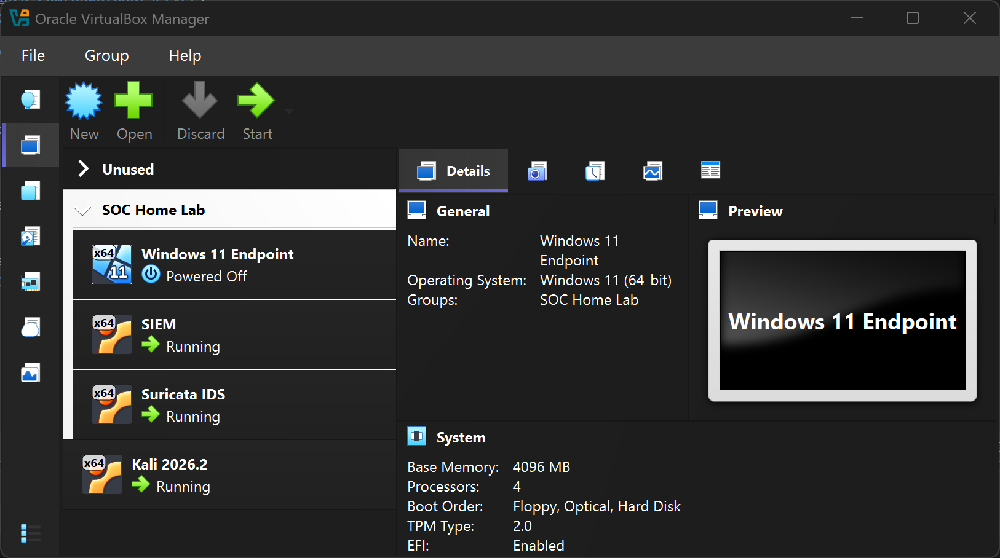
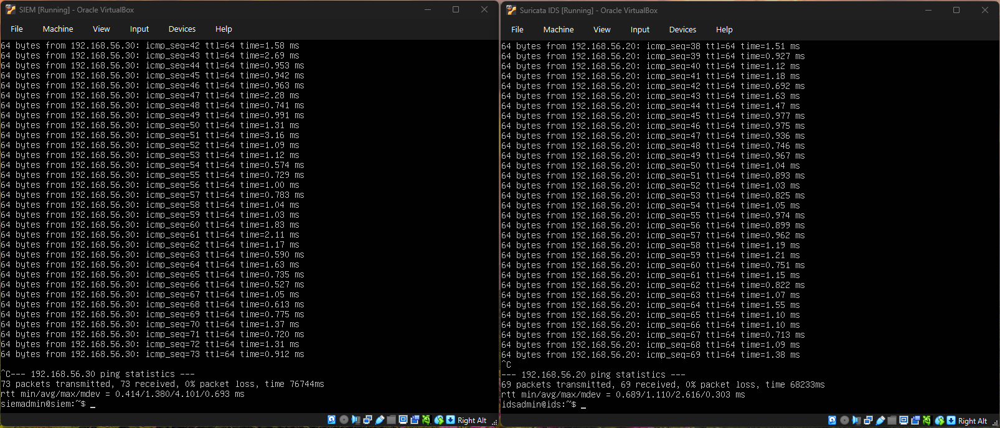
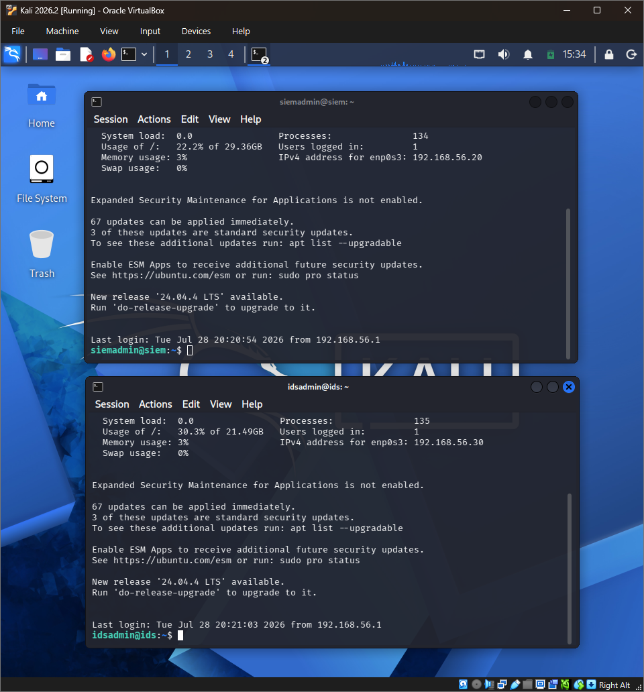

# SOC Home Lab

## Description
A hands-on Security Operations Center lab environment with SIEM and Suricata IDS integrated on a controlled network, 
used to simulate attacks, generate logs, and develop detection rules. Four VMs will be used: a linux server, 
a Windows 11 endpoint, an SOC server, and an attackbox.

For the SIEM VM, it is recommended to have 8gb RAM (base memory: 8192 MB).

## VM Recommended Specifications
### SIEM
- OS: Ubuntu 22.04
- CPU: 4
- RAM: 8GB
- Storage: 60GB

### Suricata
- OS: Ubuntu 22.04
- CPU: 4
- RAM: 8GB
- Storage: 50GB

### Windows 11 Endpoint
- OS: Windows 11
- CPU: 
- RAM: 
- Storage: 

### Kali (Attacker)
- OS: 
- CPU: 8
- RAM: 12GB
- Storage: 50GB

## Tools & Programs
- [VirtualBox](https://www.virtualbox.org/)
- [Windows 11 Enterprise ISO](https://info.microsoft.com/ww-landing-windows-11-enterprise.html)
- [Ubuntu Server ISO](https://ubuntu.com/download/server)
- [Kali Linux](https://www.kali.org/)
- [Wazuh](https://wazuh.com/)
- [Suricata](https://suricata.io/)

## Notes
- SIEM VM froze / CPU#1 lock
- Downgraded from Ubuntu 26.04 to 22.04 for both SIEM and Suricata IDS VMs in order to get installed tools working properly. 

## In Progress
### Completed
- VM overview:

- SIEM & Suricata IDS VMs setup

- Attackbox VM setup

### To-Do
- Windows 11 VM setup
- Wazuh Installed on SIEM VM
- Suricata Installed on Suricata IDS VM