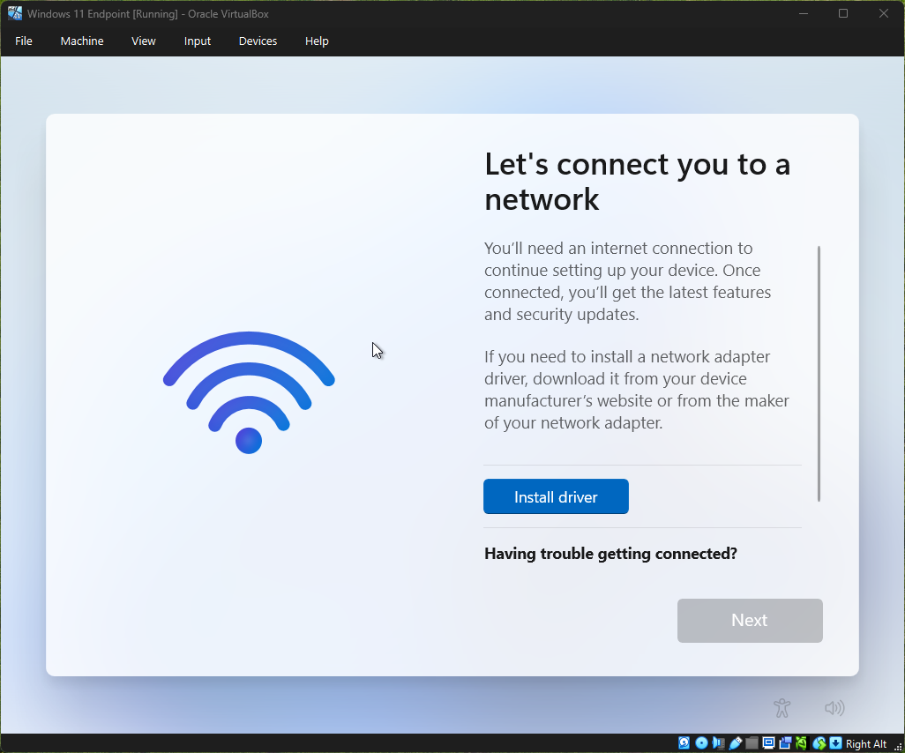
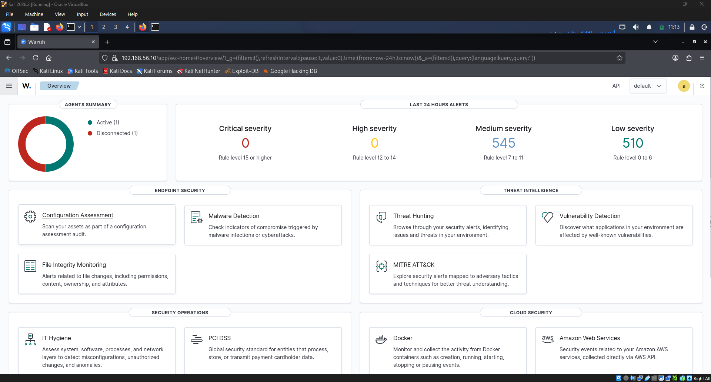
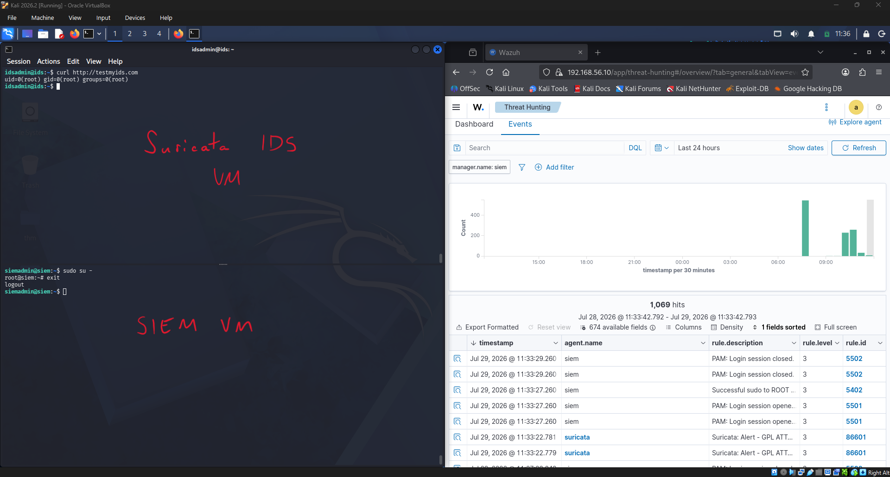

# SOC Home Lab

## Description
A hands-on Security Operations Center lab environment with SIEM and Suricata IDS integrated on a controlled network, 
used to simulate attacks, generate logs, and develop detection rules. Four VMs will be used: SIEM server, 
IDS server, an endpoint workstation, and an attackbox. 

## VM Specifications Used
### SIEM
- OS: Ubuntu 22.04.5 LTS
- CPU: 4
- RAM: 8GB
- Storage: 60GB

### Suricata IDS
- OS: Ubuntu 22.04.5 LTS
- CPU: 4
- RAM: 8GB
- Storage: 50GB

### Endpoint Workstation
- OS: Windows 11
- CPU: 4
- RAM: 8GB
- Storage: 60GB

### Attackbox
- OS: Kali 2026.2
- CPU: 8
- RAM: 12GB
- Storage: 64GB

## Tools & Programs
- [VirtualBox](https://www.virtualbox.org/)
- [Windows 11](https://www.microsoft.com/en-us/software-download/windows11)
- [Ubuntu Server](https://ubuntu.com/download/server)
- [Kali Linux](https://www.kali.org/)
- [Wazuh](https://wazuh.com/)
- [Suricata](https://suricata.io/)
- [Rufus](https://rufus.ie/en/)

## Notes
- Started project over due issues installing Wazuh on the newest version of Ubuntu (26.04). 
- Wazuh does not support versions past 22.04 on Ubuntu.
- Bypass "Let's connect you to a network" screen with type `Shift + F10` and then `OOBE\BYPASSNRO`. Windows restarts initial setup:

## In Progress
I was having issues installing Windows 11 without internet connection. 

### Completed
- VM overview:

- SIEM & Suricata IDS VMs setup

- Attackbox VM setup

- Wazuh and Suricata installed

### To-Do
[ ] Install Windows 11 OS
[ ] Files installed on Windows:
- Sysmon.exe
- Wazuh agent
- Sysinternals Suite
- Atomic Red Team PowerShell module
- Caldera agent (optiona)
- EICAR test file (optional)